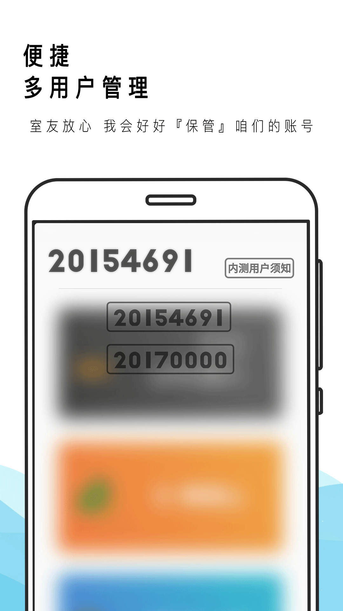
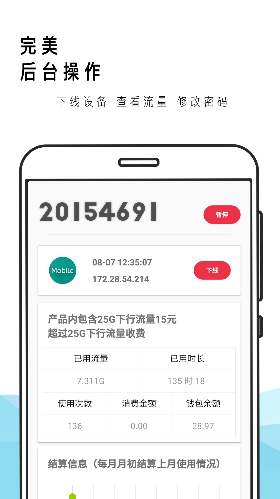
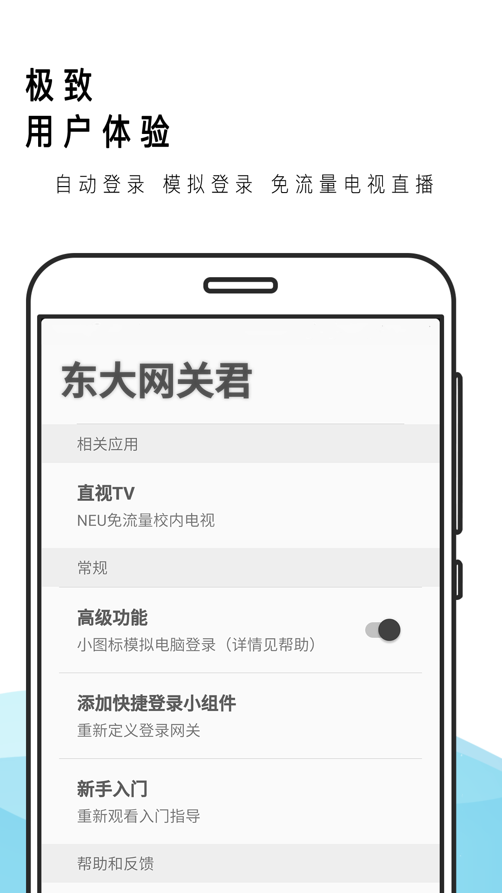

东大人登录网关的绝佳选择，~~在校~~学长工匠之作。

### 简介

东大网关君是东大人每日登录校园网的必备应用，在简洁易用的同时，加入了更多高级功能，将复杂隐于简单之下，不失优雅。

相比于同类软件，网关君所包含的特点有：

1. 美    融合最主流的卡片式设计与Material Design，整个应用都充满着清新的味道，弥散阴影的设计好似点睛之笔使网关君清新脱俗。

2. 简单    如果你不需要网关君提供的高级功能，那么在东大进行流畅的网上冲浪只需要每日清晨的两秒钟，打开应用的一瞬间，网关君就会自动为您连接网络，方便快捷。

3. 强大    网关君还提供了更多扩展功能，模拟登录、后台管理、多用户切换......可以说，东大网关的一切玩法都在网关君中可以找到。

4. 独特    提供了校内电视直播组件，丰富了大家的校园生活。

用户交流QQ群：532607431

最新版本3.3已上架：[华为](https://appstore.huawei.com/app/C100060339)、[小米](http://app.mi.com/details?id=com.lalala.fangs.neunet)、[酷安](https://www.coolapk.com/apk/com.lalala.fangs.neunet)

感谢大家使用～

### 相关应用
[直视——校园网高清电视](https://xfangfang.github.io/NeuTV/)
